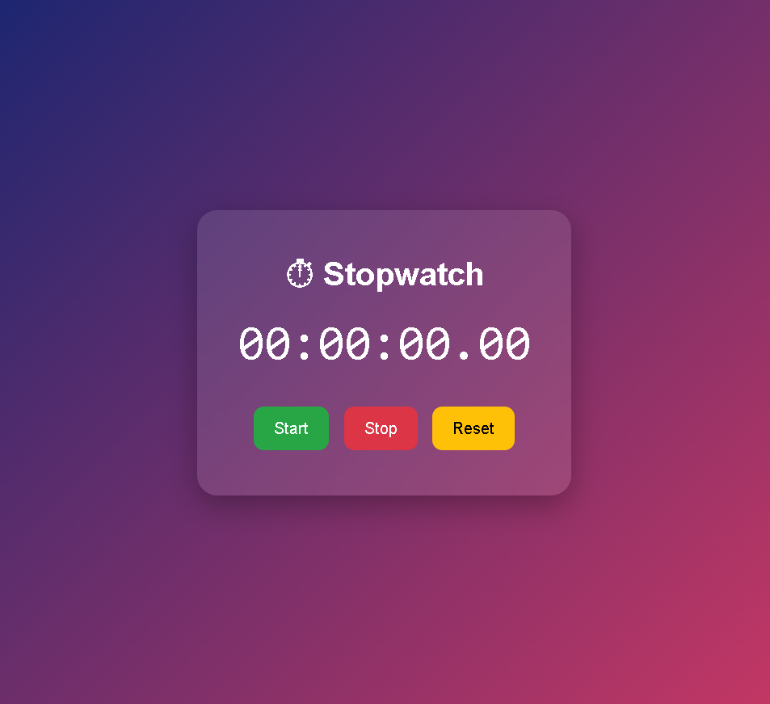
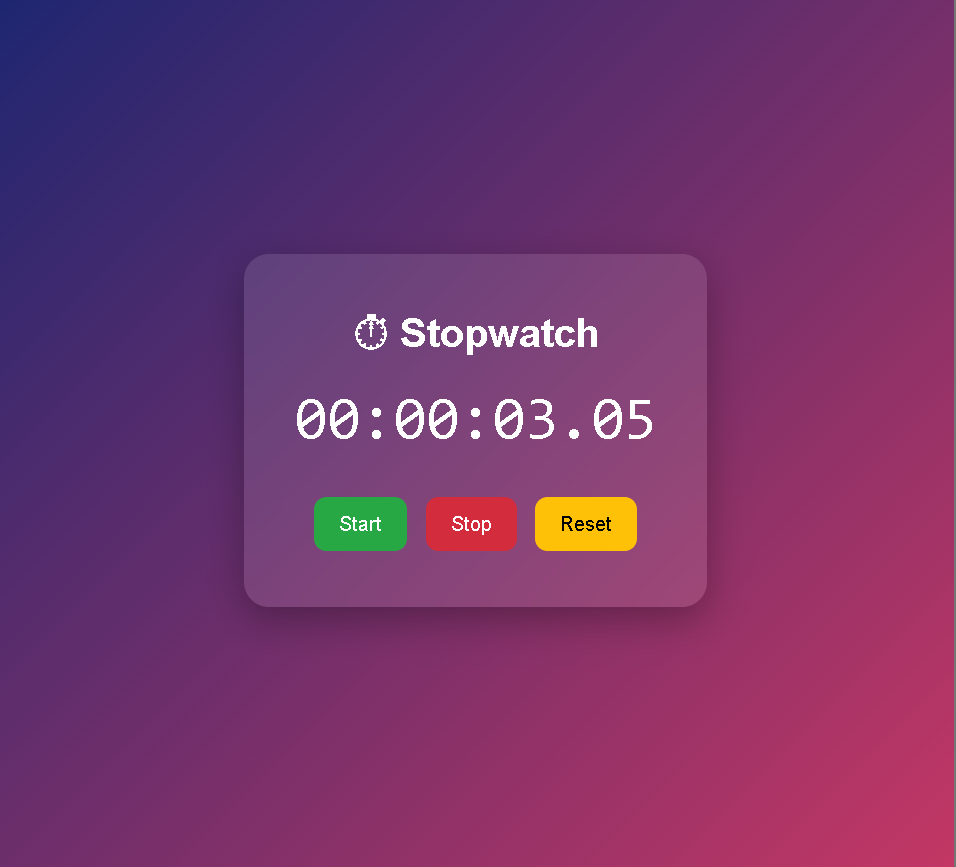

# ⏱️ Stopwatch Web Application

A sleek and responsive stopwatch web application built using **HTML**, **CSS**, and **JavaScript**.
This project demonstrates real-time time tracking, DOM manipulation, and modern UI design.

---

## 🚀 Features

* ⏯️ Start, Stop, and Reset functionality
* ⏱️ Real-time stopwatch with millisecond precision
* 🎨 Modern glassmorphism-inspired UI
* 📱 Fully responsive design
* ⚡ Smooth animations and button interactions

---

## 🛠️ Technologies Used

* **HTML5** – Structure of the application
* **CSS3** – Styling, layout, and animations
* **JavaScript (ES6)** – Logic and time calculations

---

## 📂 Project Structure

```
stopwatch/
│
├── index.html
├── style.css
├── script.js
└── README.md
```

---

## ▶️ Getting Started

### 1. Clone the repository

```bash
git clone https://github.com/mohdhi5253/modern-stopwatch
```

### 2. Navigate to the project folder

```bash
cd stopwatch
```

### 3. Run the project

Simply open the `index.html` file in your browser.

---

## 📸 Preview




---

## 🌐 Live Demo

https://mohdhi5253.github.io/modern-stopwatch/
---

## 💡 Future Enhancements

* ⏱️ Lap time tracking feature
* 🌙 Dark / Light mode toggle
* 🔊 Sound effects for controls
* 📊 Save and export recorded times

---

## 🤝 Contributing

Contributions are welcome!
If you'd like to improve this project, feel free to fork the repository and submit a pull request.

---

## 📄 License

This project is open-source and available under the **MIT License**.

---

## 👨‍💻 Author

**Mohammad Dhilawala**

* GitHub: https://github.com/mohdhi5253

---

⭐ If you like this project, consider giving it a star!
